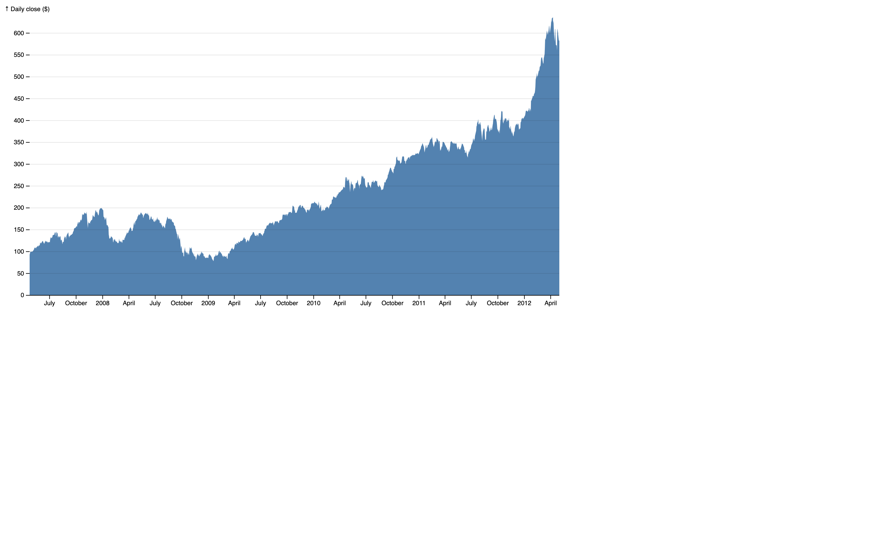

# Area Chart Example

This example demonstrates the creation of an Area Chart using JavaScript with the D3 library. The original [Area chart](https://observablehq.com/@d3/area-chart/2) template is available on Observable, and the conversion from TypeScript includes the addition of JSDoc and comments for better understanding.

## Overview

The Area Chart visualizes data over time, depicting the area between a line (representing the data) and the baseline. This example includes features such as parsing date strings, scaling axes, and rendering the area chart dynamically.

## Getting Started

To run this example:

1. Clone or download this repository to your local machine.
2. Open the HTML file (in other words, `area-chart.html`) in a web browser.

## File Structure

- `area-chart.html`: HTML file containing the Area Chart implementation.
- `area-chart.js`: JavaScript file with the converted code from TypeScript, including JSDoc and comments.
- `d3.v7.min.js`: D3 library version 7 minified file.
- `README.md`: This README file providing information about the example.

## Usage

Explore the `area-chart.js` file to understand how to create an Area Chart using D3.js. Customize the code and datasets to fit your specific requirements.

## Credits

- Original Area Chart template by [Observable](https://observablehq.com/@d3/area-chart/2).
- D3 library: [D3.js](https://d3js.org/)

## License

This example is licensed under the [MIT License](LICENSE).
