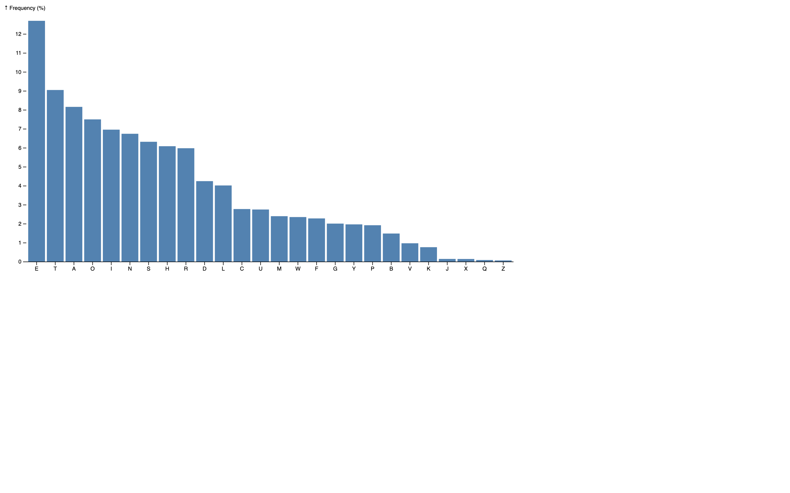

# Bar Chart Example

This example demonstrates the creation of a Bar Chart using JavaScript with the D3 library. The original [Bar chart](https://observablehq.com/@d3/bar-chart/2) template is available on Observable, and the conversion from TypeScript includes the addition of JSDoc and comments for better understanding.

## Overview

The Bar Chart is a visualization that represents data using rectangular bars with lengths proportional to the values they represent. This example includes features such as creating scales, rendering bars, and adding axes and labels dynamically.

## Getting Started

To run this example:

1. Clone or download this repository to your local machine.
2. Open the HTML file (in other words, `bar-chart.html`) in a web browser.

## File Structure

- `bar-chart.html`: HTML file containing the Bar Chart implementation.
- `bar-chart.js`: JavaScript file with the converted code from TypeScript, including JSDoc and comments.
- `d3.v6.min.js`: D3 library version 6 minified file.
- `README.md`: This README file providing information about the example.

## Usage

Explore the `bar-chart.js` file to understand how to create a Bar Chart using D3.js. Customize the code and datasets to fit your specific requirements.

## Credits

- Original Bar Chart template by [Observable](https://observablehq.com/@d3/bar-chart/2).
- D3 library: [D3.js](https://d3js.org/)

## License

This example is licensed under the [MIT License](LICENSE).
