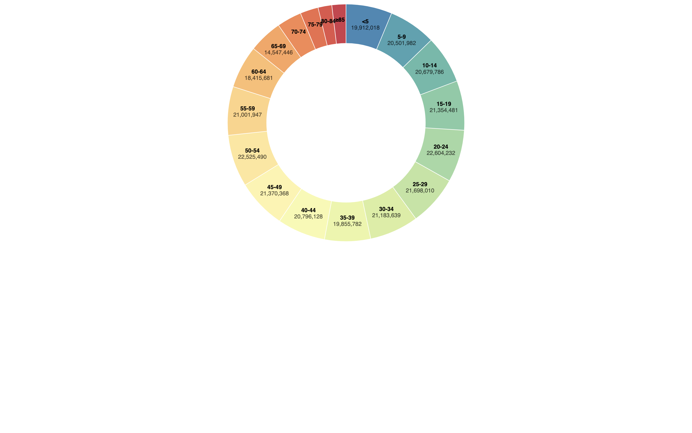

# Donut Chart Example

This example demonstrates the creation of a Donut Chart using JavaScript with D3 library. The original [Donut chart](https://observablehq.com/@d3/donut-chart/2) template was created by [Mike Bostock](https://observablehq.com/@mbostock).

## Overview

The Donut chart visualizes data in a circular form, allowing easy comparison of relative proportions within a dataset. It includes features such as dynamic resizing based on the screen width, colourful segment differentiation, and interactive tooltips for better data understanding.

## Getting Started

To run this example, make sure you have the necessary dependencies and follow these steps:

1. Clone or download this repository to your local machine.
2. Open the HTML file (in other words, `donut-chart.html`) in a web browser.

## File Structure

- `donut-chart.html`: HTML file containing the Donut chart implementation.
- `donut-chart.js`: JavaScript file with the converted code from TypeScript, including JSDoc and comments.
- `d3.v7.min.js`: D3 library version 7 minified file.
- `README.md`: This README file providing information about the example.

## Usage

Adjust the data in the `data` array within the `donut-chart.js` file to visualize different datasets. You can also customize chart properties based on your requirements.

## Credits

- Original Donut chart template by [Mike Bostock](https://observablehq.com/@mbostock).
- D3 library: [D3.js](https://d3js.org/)

## License

This example is licensed under the [MIT License](LICENSE).
