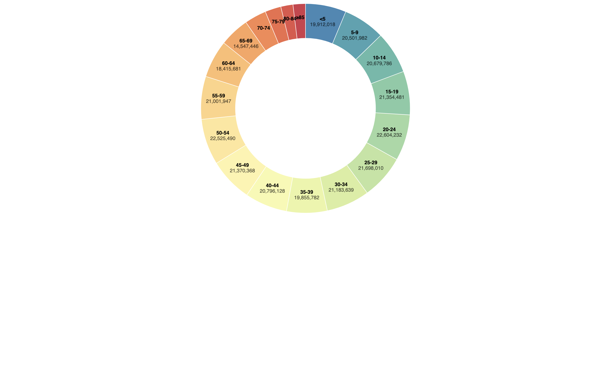

# Donut chart

A donut chart showing proportional data with coloured segments. Based on a [template by Mike Bostock](https://observablehq.com/@mbostock) on Observable.

## Files

- `donut-chart.html`
- `donut-chart.js`—D3 implementation
- `d3.v7.min.js`
