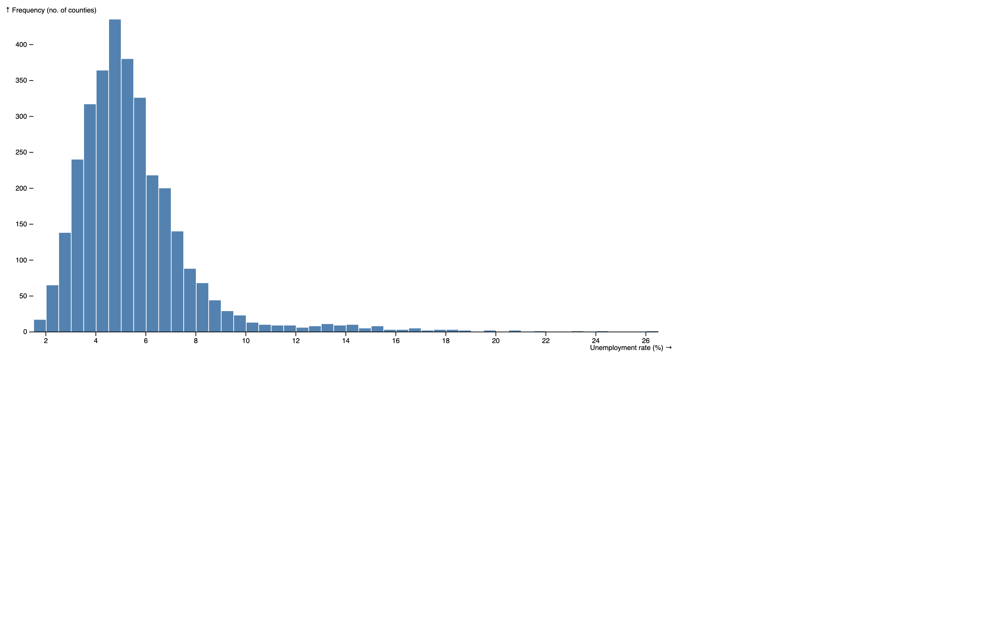

# Histogram Example

This example demonstrates the creation of a Histogram using JavaScript with the D3 library. The original [Histogram](https://observablehq.com/@d3/histogram/2) template is available on Observable, and the conversion from TypeScript includes the addition of JSDoc and comments for better understanding.

## Overview

The Histogram is a visualization that displays the distribution of data by dividing it into bins and counting the number of occurrences in each bin. This example includes features such as binning data, configuring scales, and adding axes and labels dynamically.

## Getting Started

To run this example:

1. Clone or download this repository to your local machine.
2. Open the HTML file (in other words, `histogram.html`) in a web browser.

## File Structure

- `histogram.html`: HTML file containing the Histogram implementation.
- `histogram.js`: JavaScript file with the converted code from TypeScript, including JSDoc and comments.
- `d3.v6.min.js`: D3 library version 6 minified file.
- `README.md`: This README file providing information about the example.

## Usage

Explore the `histogram.js` file to understand how to create a Histogram using D3.js. Customize the code and datasets to fit your specific requirements.

## Credits

- Original Histogram template by [Observable](https://observablehq.com/@d3/histogram/2).
- D3 library: [D3.js](https://d3js.org/)

## License

This example is licensed under the [MIT License](LICENSE).