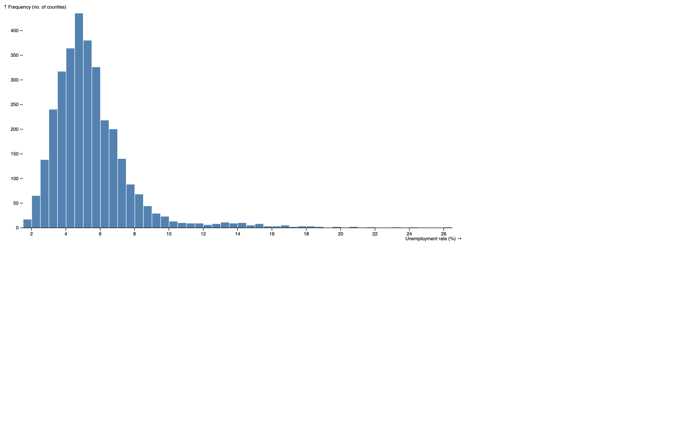

# Histogram

A histogram showing the distribution of US unemployment rates, binned using `d3.bin`. Based on the [D3 histogram example](https://observablehq.com/@d3/histogram/2) on Observable.

## Files

- `histogram.html`
- `histogram.js`—D3 implementation
- `data.js`—unemployment rate dataset
- `d3.v7.min.js`
