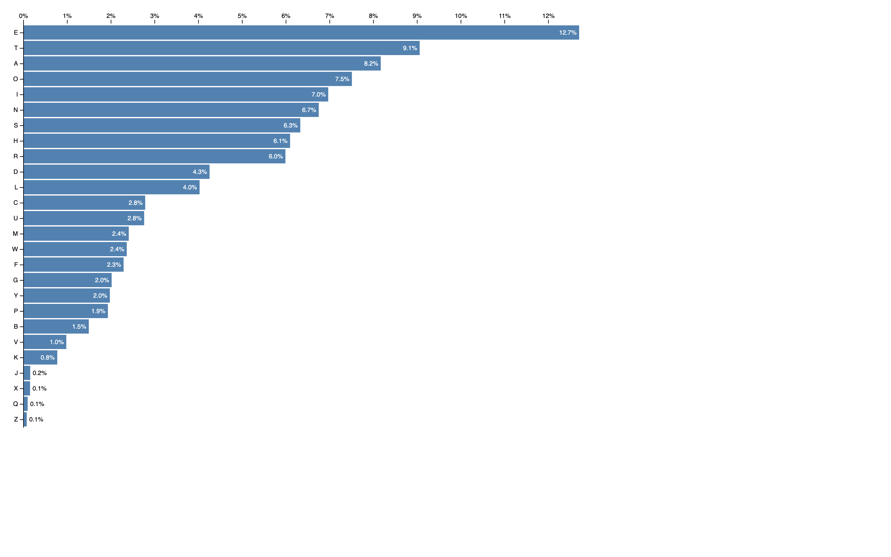

# Horizontal Bar Chart Example

This example showcases the creation of a Horizontal Bar Chart using JavaScript with the D3 library. The original [Horizontal bar chart](https://observablehq.com/@d3/horizontal-bar-chart/2) template is available on Observable, and the conversion from TypeScript includes the addition of JSDoc and comments for better clarity.

## Overview

The Horizontal Bar Chart visualizes data in a horizontal orientation, making it suitable for comparing values across different categories. The chart dynamically adjusts to the dataset, allowing for easy customization and understanding of the data.

## Getting Started

To run this example, follow these steps:

1. Clone or download this repository to your local machine.
2. Open the HTML file (in other words, `horizontal-bar-chart.html`) in a web browser.

## File Structure

- `horizontal-bar-chart.html`: HTML file containing the Horizontal Bar Chart implementation.
- `horizontal-bar-chart.js`: JavaScript file with the converted code from TypeScript, including JSDoc and comments.
- `d3.v7.min.js`: D3 library version 7 minified file.
- `README.md`: This README file providing information about the example.

## Usage

Adjust the data in the `alphabetCounts` array within the `horizontal-bar-chart.js` file to visualize different datasets. You can also customize chart properties based on your requirements.

## Credits

- Original Horizontal Bar Chart template by [Observable](https://observablehq.com/@d3/horizontal-bar-chart/2).
- D3 library: [D3.js](https://d3js.org/)

## License

This example is licensed under the [MIT License](LICENSE).
