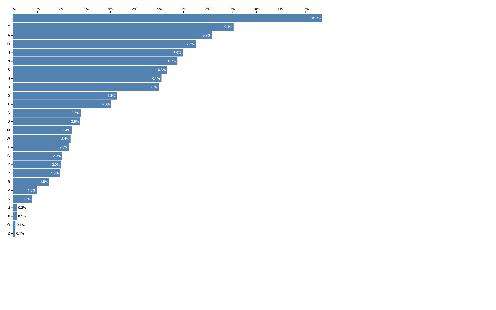

# Horizontal bar chart

A horizontal bar chart showing English letter frequency. Based on the [D3 horizontal bar chart example](https://observablehq.com/@d3/horizontal-bar-chart/2) on Observable.

## Files

- `horizontal-bar-chart.html`
- `horizontal-bar-chart.js`—D3 implementation
- `d3.v7.min.js`
