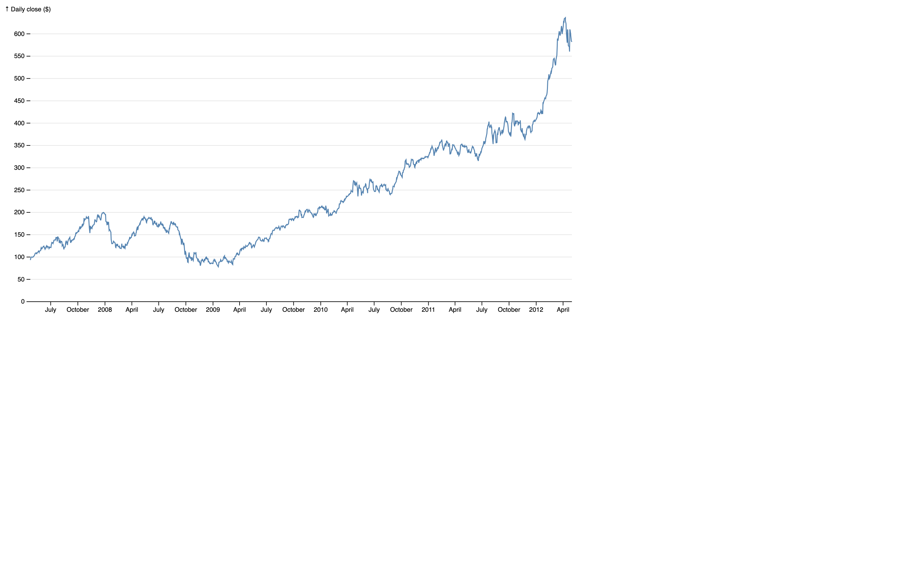

# Line chart

A line chart showing Apple (AAPL) stock closing prices over time. Based on the [D3 line chart example](https://observablehq.com/@d3/line-chart/2) on Observable.

## Files

- `line-chart.html`
- `line-chart.js`—D3 implementation
- `data.js`—AAPL dataset
- `d3.v7.min.js`
